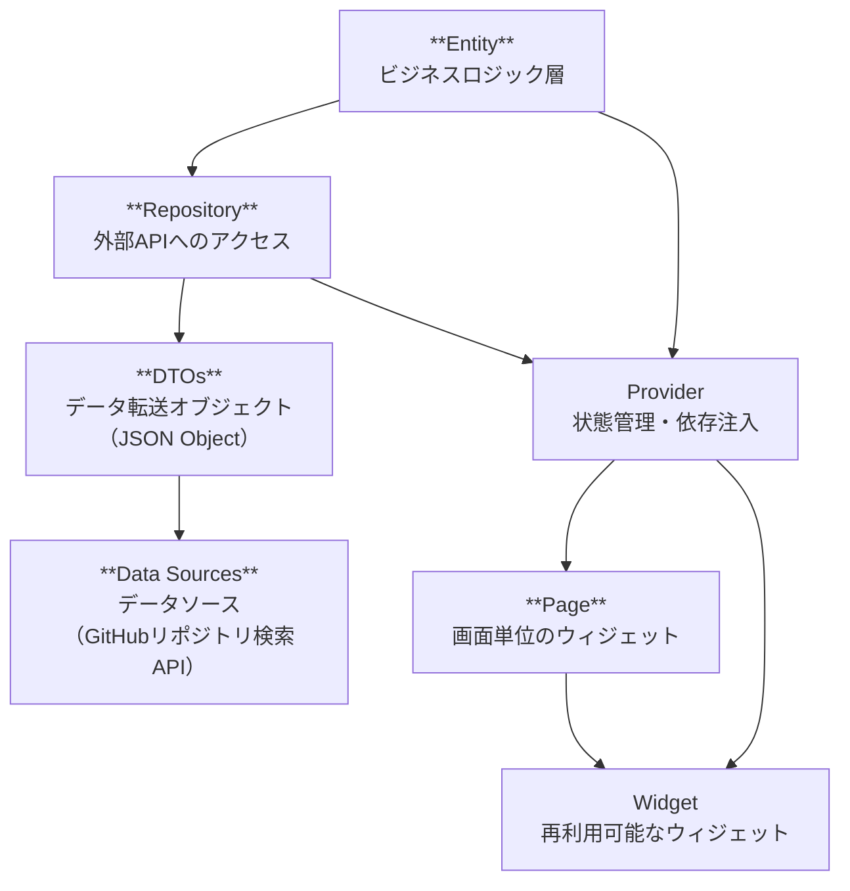

# ARCHITECTURE.md

## なぜこのドキュメントが必要か

本ドキュメントは、プロジェクトの物理的な構造（アーキテクチャ）を新規・既存のコントリビューターに伝えるためのものです。特に中規模以上のプロジェクトでは、どこに何があるかを把握することが最初の大きなハードルとなります。アーキテクチャの概要を共有することで、次のようなメリットがあります。

- 新規参加者が「どこを触ればよいか」「どこに何があるか」を素早く理解できる
- コア開発者以外も効率的に開発・修正・レビューができる
- プロジェクトの設計思想や重要な不変条件（例 : 依存関係の制約）を明示できる
- 将来的なリファクタリングや機能追加時にも全体像を見失いにくくなる

このドキュメントは、全体像や主要なモジュール・ディレクトリの関係、レイヤーの境界、設計上の重要なポイントを簡潔にまとめることを目的とします。

## ディレクトリ構造



> Mermaid記法による依存関係図例です。Mermaid対応ビューアーでご覧ください。  
> 例えば、GitHub上で見るか、VSCodeの拡張機能をご利用ください。

### lib・test ディレクトリ構成と役割

```text
.
├── lib/                                        # アプリケーションのプロダクトコード
│   ├── extension/                              # 標準/独自クラスへの拡張メソッド
│   ├── features/                               # 機能（feature）単位でまとめるディレクトリ
│   │   └── repository_search/                 # リポジトリ検索機能
│   │       ├── domain/                        # ビジネスロジック層
│   │       │   ├── entity/                    # エンティティ
│   │       │   └── repository/                # リポジトリインターフェース等
│   │       └── presentation/                  # プレゼンテーション層（UI, Providers）
│   │           ├── common/                    # 共通部品
│   │           │   └── widget/                # 共通Widget
│   │           ├── page/                      # 画面単位のWidget
│   │           │   ├── repository_details/   # リポジトリ詳細画面
│   │           │   │   └── widget/           # リポジトリ詳細画面のWidget
│   │           │   └── repository_search/     # リポジトリ検索画面
│   │           │       └── widget/            # リポジトリ検索画面のWidget
│   │           └── provider/                   # Provider群
│   ├── l10n/                                   # 多言語対応リソース・ローカライズ関連
│   └── static/                                 # 定数・静的データ
│
├── test/                                       # アプリケーションのテストコード
│   ├── extension/                              # 拡張メソッドのテスト
│   ├── features/                               # 機能単位のテスト
│   │   └── repository_search/                  # リポジトリ検索機能のテスト
│   │       ├── domain/                         # ドメイン層のテスト
│   │       │   ├── entitiy/                    # エンティティのテスト（※typo注意）
│   │       │   └── repository/                 # リポジトリのテスト
│   │       └── presentation/                   # プレゼンテーション層のテスト
│   │           ├── common/                     # 共通部品のテスト
│   │           │   └── widget/                 # 共通Widgetのテスト
│   │           └── page/                       # 画面単位のテスト
│   │               ├── repository_details/     # リポジトリ詳細画面のテスト
│   │               │   └── widget/            # リポジトリ詳細画面のWidgetのテスト
│   │               └── repository_search/      # リポジトリ検索画面のテスト
│   │                   └── widget/             # リポジトリ検索画面のWidgetのテスト  
│   ├── mock/                                   # モック・スタブ
│   └── test_util/                              # テスト共通ユーティリティ
│
├── tool/         # 開発用スクリプト・ツール
├── android/      # Androidネイティブ関連
├── ios/          # iOSネイティブ関連
├── macos/        # macOSネイティブ関連
├── linux/        # Linuxネイティブ関連
├── windows/      # Windowsネイティブ関連
├── web/          # Web関連
├── build/        # ビルド成果物
├── documents/    # ドキュメント
```

### 具体例

- `features/repository_search/domain/entities/` : 他の機能に依存しない単一のコードを書く
  - `repository.dart`
  - `owner.dart`
- `features/repository_search/infrastructure/repositories/` : APIなどにアクセスするコードを書く
  - `github_api_repository.dart`
- `features/repository_search/presentation/providers/` : domain側の機能をUIへと提供するコードを書く
  - `repository_providers.dart`
- `view/page/` : UIとして見せるためのコードを書く
  - `repository_search_page.dart`
  - `repository_details_page.dart`

## 設計上のポイント・レイヤーの境界

### 全体的な設計方針

- `features/`配下は単方向データフローを意識し、下記の依存方向を守ります。

```text
entity --> infrastructure -- (Provider) --> presentation
```

- ここで `依存` とは、あるモジュールが他のモジュールの機能を利用することを指します。
  - 例えば、`presentation`層のWidgetが`domain`層のエンティティを利用する場合、`presentation`は`domain`に依存していると言えます。
  - 逆に、`domain`層のエンティティが`presentation`層のWidgetを利用することはありません。

### Domain層について (entity, repository)

- `domain/`配下には、ビジネスロジックやドメインモデルを配置します。
  - `entity/`には、アプリケーションのビジネスロジックに必要なエンティティを定義します。
    - 例 : `repository.dart`、`owner.dart`
  - `repository/`には、ドメイン層のリポジトリインターフェースを定義します。
    - 例 : `github_search_api_repository.dart`

### 状態管理について

- 状態は、以下の２つに大別されます。
  - 一時的な状態（Ephemeral State） : UIの一時的な状態やローカルな状態
  - アプリケーション全体の状態（App State） : ユーザーのセッションやアプリ全体に影響する状態
  - 参考 : [Differentiate between ephemeral state and app state](https://docs.flutter.dev/data-and-backend/state-mgmt/ephemeral-vs-app)
- 一時的な状態は、基本的にStatefulWidgetで管理します。
- アプリケーション全体の状態は、Riverpodの各種Providerで管理します。

### UIの構成について

- UI部品は`presentation/`配下で再利用性を意識して分割します。
  - 共通で使うWidgetは`common/widget/`に配置し、再利用性を高めます。
  - `presentation/page/`配下には、画面単位のWidgetを配置します。
  - `presentation/widget/`配下には、再利用可能な個別のWidgetを配置します。
  - `presentation/provider/`配下には、状態管理のためのProviderを配置します。
- テストもlibと同じ構造で配置します。

### その他

- 多言語対応は`l10n/`で一元管理し、Flutterのローカライズ機構を活用します。
  - 多言語対応方法については、[`how-to-add-strings.md`](how-to-add-strings.md)を参照して下さい。

## Feature-first構成の採用

- 中〜大規模アプリでは「機能ごと（feature-first）」のディレクトリ構成が推奨されており、本プロジェクトもこれを基本としています。
  - 各feature配下に`domain`/`infrastructure`/`presentation`等のレイヤーを内包し、機能追加・削除・保守が容易です。
  - 「feature」はUI単位ではなく、ユーザーの“やりたいこと”やドメイン単位で分けることを意識しています。
  - 生成AIを用いた開発でも機能ごとに分けてある方が依存が散らばらず、生成AIのコード生成が適切になりやすくなります。
- 一方で、本アプリは「2画面のみ」「利用APIも1つのみ」とシンプルなため、過度なレイヤー分割や抽象化は行っていません。
  - 具体的には Application Service/Domain Service層やBFF層は省略しています。
  - ただし、将来的な拡張性を考慮し、必要に応じて追加可能な設計としています。
    - 例えば将来的にPOSTするような機能が追加された場合、下記のような構成を追加することができます。
      - `features/repository_search/domain/service/`
      - `features/repository_search/infrastructure/service/`

## その他（状態管理・テスト・共通部品）

- Riverpod等を活用し、SSoT（Single Source of Truth）・単方向データフロー・immutable設計を徹底しています。
- 共通部品やモデルは`static`や`provider`、`view/widget`等で管理し、“ごみ箱化”（なんでもまとめてしまうこと）しないよう注意しています。
- テストはlibと同じ構造で配置し、mockito等で差し替えやすい設計です。生成AIの進化も活用し、テストコードを積極的に記述しています。

## 命名規則・コーディング規約

- 詳細は `documents/styles_guideline.md` を参照してください。
  - クラス名はパスカルケース
  - 変数名はキャメルケース
  - 定数はアッパースネークケース
  - etc...

## テスト戦略

- 基本的なテスト戦略は Testing Trophy に基づきます。
  - 参考 : [The Testing Trophy and Testing Classifications](https://kentcdodds.com/blog/the-testing-trophy-and-testing-classifications)

## 拡張・変更時のガイド

### UIの修正・追加を行う場合

- 既存の画面（Page）やWidgetを修正する場合は、`lib/features/<feature名>/presentation/page/`や`widget/`配下の該当ファイルを編集します。
- 新しい画面やWidgetを追加する場合は、`page/`や`widget/`配下に新規ファイルを作成し、必要に応じて`provider/`で状態管理を追加します。
- 共通で使いたいWidgetは`common/widget/`配下に配置し、再利用性を高めます。
- UIの状態管理が必要な場合は、RiverpodのProviderを`provider/`配下に追加します。

### API対応（新規APIの追加や既存APIの拡張）を行う場合

- 外部APIとの連携は`lib/features/<feature名>/infrastructure/`配下に実装します。
- 新しいAPIエンドポイントに対応する場合は、`repository/`や`service/`ディレクトリを作成し、APIアクセス用のクラスやメソッドを追加します。
- APIレスポンスのモデルは`domain/entity/`に追加し、Freezed等でイミュータブルなデータ構造を定義します。
- APIの取得・更新処理はRepository経由で行い、presentation層から直接APIを呼ばないようにします。

### ドメインロジックの追加・修正を行う場合

- ビジネスロジックやバリデーション等は`domain/`配下に実装します。
- 新しいユースケースやサービスが必要な場合は、`service/`ディレクトリを作成し、責務ごとにクラスを分割します。
- ドメイン層のテストは`test/features/<feature名>/domain/`配下に追加します。

### 多言語対応を追加・修正する場合

- 文言の追加・修正は`lib/l10n/`配下のarbファイルを編集します。
- 編集後は`tool/l10n_generate.sh`を実行し、ローカライズファイルを自動生成します。
- 詳細な手順は`documents/how-to-add-strings.md`を参照してください。

### テストの追加・修正

- 実装に合わせて`test/`配下の該当ディレクトリにテストコードを追加・修正します。
  - 実際にはテストのコスパを考慮し、必要な部分に絞ってテストを追加します。
- モックやスタブが必要な場合は`mock/`配下に作成します。
  - モックは、実装コードと同じ構造で配置し、可読性を高めます。
- テストの構造もlibと同じディレクトリ構成を維持します。
  - テストコードは、実装コードと同様に機能ごとに分けて配置し、可読性を高めます。

## 開発環境

- 開発OS
  - macOS推奨 (iOSをターゲットに含めるため)
- 推奨IDE
  - [Visual Studio Code](https://code.visualstudio.com/)
- コード生成
  - build_runnerによるコード生成を扱います。詳細は [README.md](/README.md) を参照して下さい。
  - コード生成を実行するためのコマンド : `dart pub run build_runner watch -d`
  - コード生成を利用するパッケージ
    - Riverpod（状態管理）
    - Freezed（イミュータブルモデル）
    - json_serializable（JSONシリアライズ）
    - mockito（テスト用モック）
- 静的解析
  - [`analysis_options.yaml`](/analysis_options.yaml) で自動修正できるものは自動修正される設定にしています。
  - 詳細は ['settings.json`](/.vscode/settings.json) を参照してください。
- 多言語対応
  - l10n自動生成スクリプト（[`tool/l10n_generate.sh`](/tool/l10n_generate.sh)）を活用します。
  - 詳細は [`how-to-add-strings.md`](/documents/how-to-add-strings.md) を参照してください。
- Flutter/Dartのバージョン
  - `pubspec.yaml` を参照して下さい。
  - Flutter/Dartのバージョン管理は `fvm` を推奨します。(使用しなくても可)
