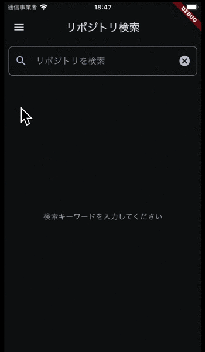

# 本アプリの機能について

- [本アプリの機能について](#本アプリの機能について)
  - [基本機能: GitHubリポジトリ検索](#基本機能-githubリポジトリ検索)
  - [検索履歴機能（★）](#検索履歴機能)
  - [テーマモードの変更（★）](#テーマモードの変更)
  - [OSS表示（★）](#oss表示)
  - [スクリーンショット](#スクリーンショット)

本プロジェクトでは以下の動作を実装しています。

> 基本要件から外れる要件は (★) マークを付けています。

## 基本機能: GitHubリポジトリ検索

- 何かしらのキーワードを入力できる
- 入力したキーワードで GitHub のリポジトリを検索できる
- GitHub のリポジトリを検索する際、GitHub API（search/repositories）を利用する
  - github | Dart Package のようなパッケージは利用せず、API を呼ぶ処理を自分で実装すること  
  ※本プロジェクトでは、[dio](https://pub.dev/packages/dio) パッケージを使用して API を呼び出しています。
- 検索結果は一覧で概要（リポジトリ名）を表示する  
  - 本プロジェクトでは+αでオーナーアイコンも表示しています。（★）
  - リスト表示は画面サイズに応じて１列または複数列で表示する。（★）
- 検索結果のアイテムをタップしたら、該当リポジトリの詳細（リポジトリ名、オーナーアイコン、プロジェクト言語、Star 数、Watcher 数、Fork 数、Issue 数）を表示する
  - 縦画面・横画面に応じて、適切なレイアウトで表示する（★）

## 検索履歴機能（★）

- 検索履歴をタップすると、検索キーワードが入力欄にセットされ検索実行される
- 検索履歴は最大10件まで保存される
- 検索履歴はアプリを再起動しても保持される
- 検索履歴は削除できる
- 検索履歴はドロワーからアクセスできる

## テーマモードの変更（★）

- アプリのテーマモードを変更できる
  - ダークモード
  - ライトモード
  - システム設定を利用（システムのテーマ設定に従う）
- テーマモードの変更はドロワーからアクセスできる
- アプリのテーマモードはアプリを再起動しても保持される

## OSS表示（★）

- アプリのOSS表示画面を表示できる
- OSS表示画面では、アプリで使用しているOSSのライセンス情報を確認できる
- OSS表示画面はドロワーからアクセスできる

## スクリーンショット

| 基本機能 | 検索履歴機能 | テーマモードの変更 | OSS表示 |
| - | - | - | - |
|  |  |  |  |